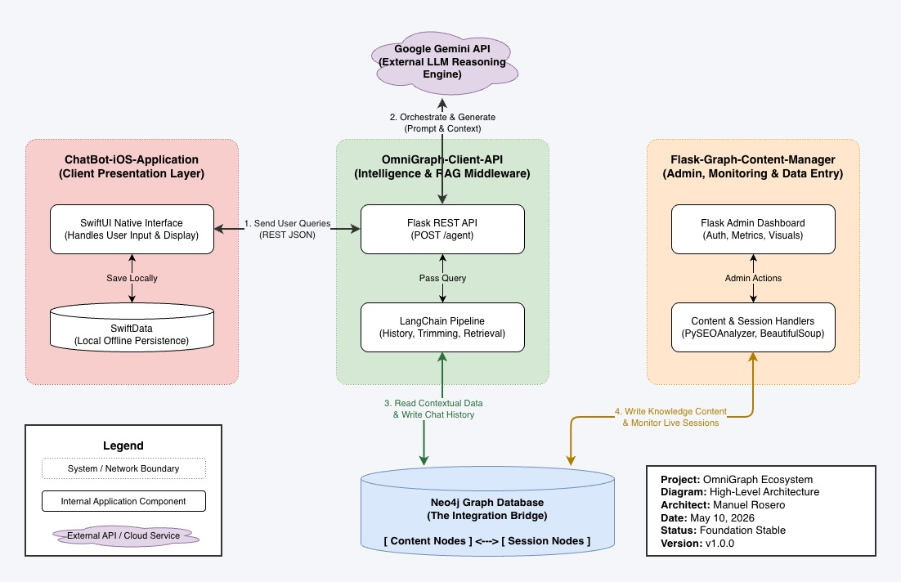
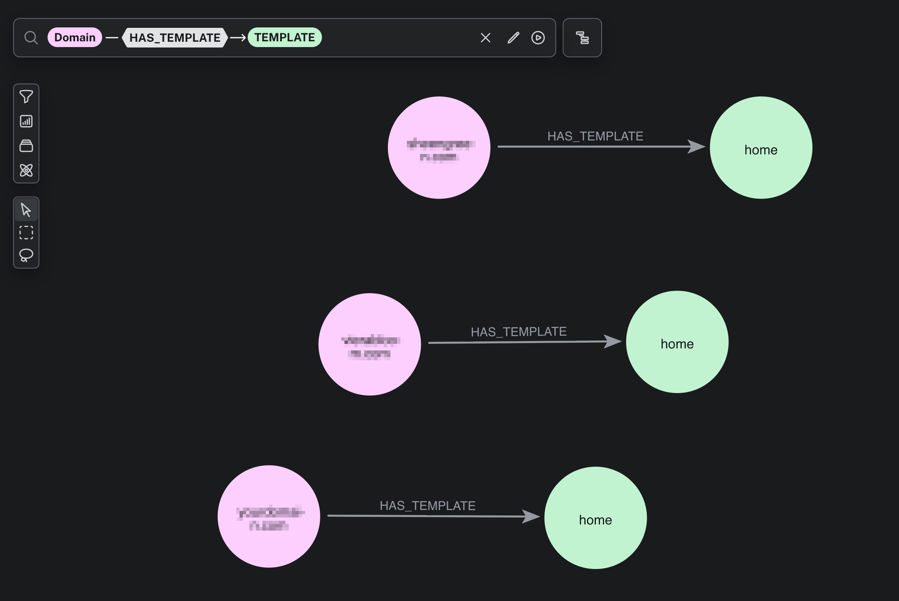

# OmniGraph-Client-API


## Overview
**OmniGraph-Client-API** is a high-performance RAG (Retrieval-Augmented Generation) engine designed to provide context-aware AI responses. By integrating LangChain with Google Gemini and Neo4j, this API orchestrates a sophisticated pipeline that manages long-term memory, message trimming, and graph-based context retrieval to deliver exceptionally relevant interactions.

## System Architecture
As the "Intelligence & RAG Middleware," this API coordinates the flow of data between the user interface and the persistent storage layer.


*Figure 1: High-level architecture of the OmniGraph Ecosystem.*

## The Ecosystem Context
The API serves as the "brain" of the OmniGraph ecosystem. It bridges the gap between the **ChatBot-iOS-Application** (the client) and the **Flask-Graph-Content-Manager** (the admin layer).
- **Inbound:** It receives queries from the iOS client via secure POST requests.
- **Processing:** It retrieves session history and relevant context from the Neo4j graph database.
- **Outbound:** It returns optimized AI responses while updating the graph with new interaction data, ensuring a persistent and evolving memory.

## Visualizing the Knowledge Graph
The API leverages a graph-based schema to map domains to content templates, allowing the RAG pipeline to traverse relationships rather than just performing keyword searches.


*Figure 2: Active Neo4j nodes showing the relationship between Domains and Templates.*

## Key Features
- **Retrieval-Augmented Generation (RAG):** Combines LLM capabilities with a private graph knowledge base for grounded responses.
- **Persistent Graph Memory:** Uses Neo4j to store and retrieve chat history, allowing for truly conversational AI.
- **Advanced Context Management:** Implements message trimming and windowing to optimize token usage and maintain relevance.
- **Google Gemini Integration:** Leverages the latest Gemini models for high-reasoning and creative generation.
- **Cross-Origin Support:** Fully configured with CORS for seamless integration with mobile and web clients.
- **Visitor Tracking:** Captures IP and session metadata to build detailed interaction graphs.

## Tech Stack
- **Backend Framework:** Flask, Python 3.x
- **AI Framework:** LangChain (Core, Community, Google GenAI)
- **LLM:** Google Gemini Flash/Pro
- **Graph Database:** Neo4j
- **Orchestration:** RunnableWithMessageHistory, TrimMessages

## Getting Started

### Local Setup
1. **Clone the repository:**
   ```bash
   git clone https://github.com/your-username/OmniGraph-Client-API.git
   cd OmniGraph-Client-API
   ```

2. **Setup environment:**
   ```bash
   python -m venv venv
   source venv/bin/activate
   pip install -r requirements.txt
   ```

3. **Configuration:**
   Create a `.env` file:
   ```env
   GOOGLE_API_KEY=your_gemini_api_key
   NEO4J_URI=neo4j+s://your-db-id.databases.neo4j.io
   NEO4J_USER=neo4j
   NEO4J_PASSWORD=your_password
   ```

4. **Start the API:**
   ```bash
   python app.py
   ```
   The API will listen on `http://0.0.0.0:5050`.

## Usage / API Reference
### Invoke Agent
**Endpoint:** `POST /agent`

**Request Body:**
```json
{
  "message": "Tell me about the recent project updates.",
  "config": "session_id_123"
}
```

**Response:**
```json
{
  "answer": "The recent updates include..."
}
```

## License
This project is licensed under the MIT License.
